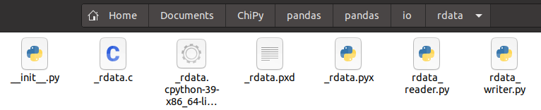
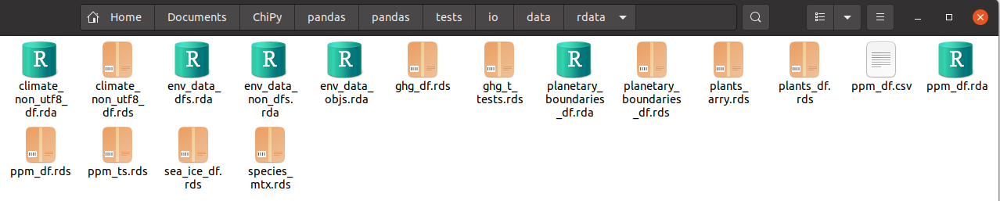

```{r setup, include=FALSE}
knitr::opts_chunk$set(echo = TRUE)
```

## Pandas IO Tools

```{r echo=FALSE}

```

- Well-known, popular data analytics library
- Many read and write handlers to import/export data
- IO Tools: https://pandas.pydata.org/pandas-docs/stable/user_guide/io.html

## R Serialization Types

- Binary, compressed formats (.bzip2, .gz, .xz) for *any* R object(s)
- RData/rda types:
   - `save()`/`load()`
- rds types
   - `saveRDS()`/`readRDS()`

## Saving Examples

```{r, eval=FALSE, out.length = '100%'}
# MULTIPLE OBJECTS
save(df1, df2, df3, file="/path/to/myrdata.rda", compress="gzip")
load("/path/to/myrdata.rda")

# INDIVIDUAL OBJECTS
saveRDS(df1, file="/path/to/df1.rds", compression="bzip2")
new_df1 <- readRDS("/path/to/df1.rds")

saveRDS(df2, file="/path/to/df2.rds", compression="xz")
new_df2 <- readRDS("/path/to/df2.rds")

saveRDS(df3, file="/path/to/df3.rds", compression=FALSE)
new_df3 <- readRDS("/path/to/df3.rds")
```

# How to read/write R data in Python outside of R?

## C Library Tool

- Lightweight C library: [librdata](https://github.com/WizardMac/librdata)
- Read/write data frames stored R data types
- Python + C => Cython => compiled .so/.pyd => `import rdata`

```{r echo=FALSE, out.width = '100%'}

```

## Pandas IO Module

- Cython extension (compiled in Linux, Windows, Mac)
- Handles compression, http/ftp/s3 paths, file-like objects
- Signature of module, `pandas.io.rdata`:

```{python, eval=FALSE, out.width = '100%'}
import pandas as pd

# READ RDATA
dfs = pd.read_rdata("/path/to/rds_file.rds")

dfs = pd.read_rdata("/path/to/rda_file.rda", 
  file_format="rda", rownames = False,
  select_frames=["df1", "df3", "df5"],
)
# WRITE RDATA
df1.to_rdata("/path/to/new/rds_file.rds")
df2.to_rdata("/path/to/new/rda_file.rda", 
    rda_name="my_df", index=False, compression="bz2"
)
```

## Additional Work

- Documentation: alternative [user_guide.rst](pandas-user-guide-io-tools.html)
- Unit tests: prepared test data `prep_test_rdata.R`

```{r echo=FALSE, out.width = '100%'}

```

- Continuous integration across all OSes and Python versions
- Code Standards: C files linting, mypy, pytests
- Licenses: MIT licenses/public domain notices
- Open Pull Request: [#41386](https://github.com/pandas-dev/pandas/pull/41386)


